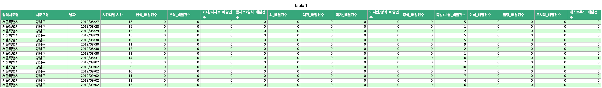
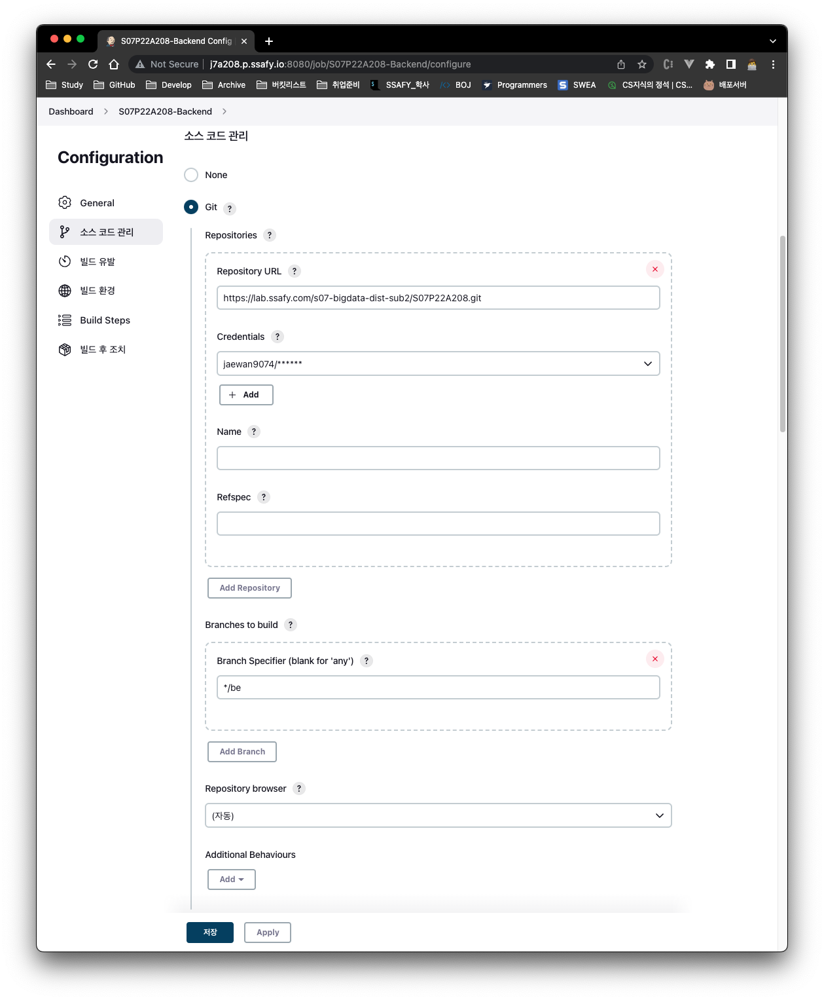
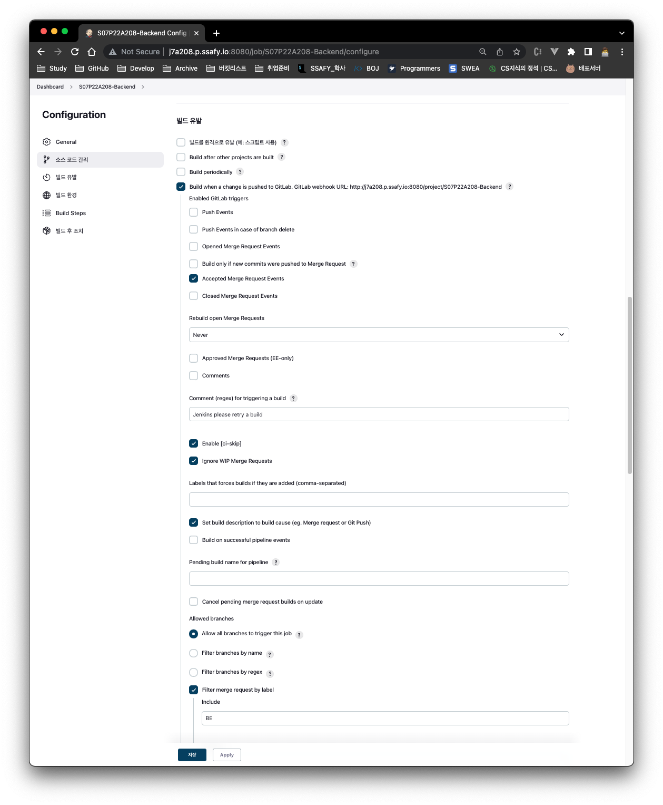
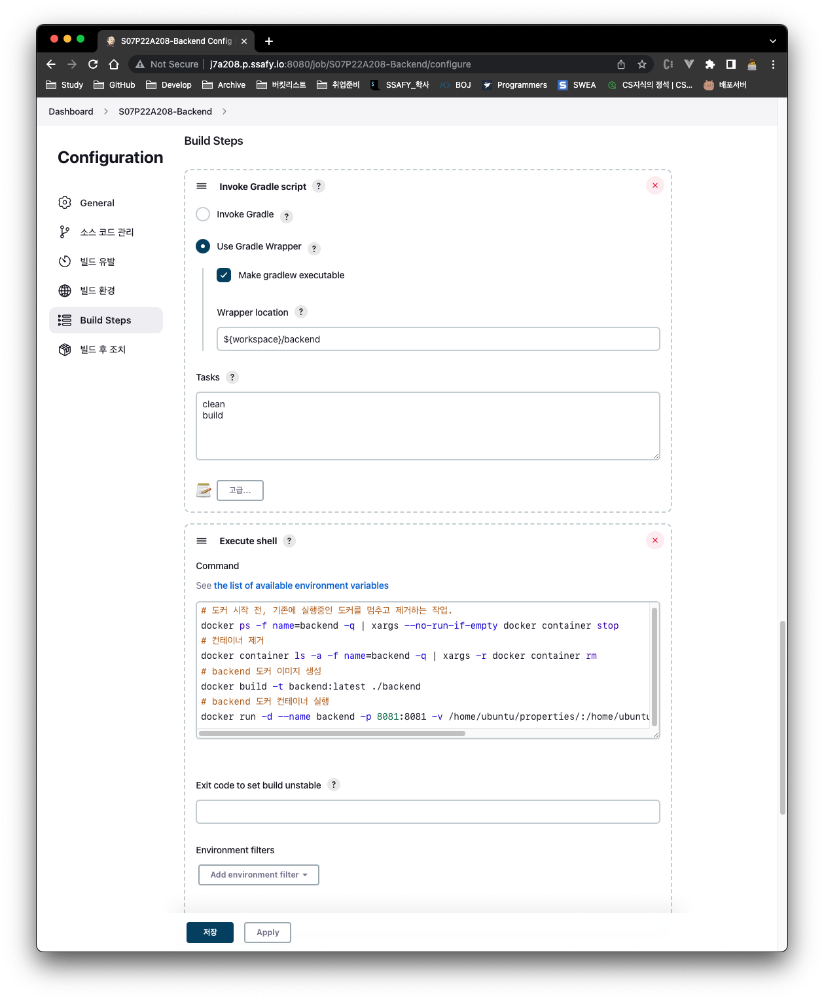
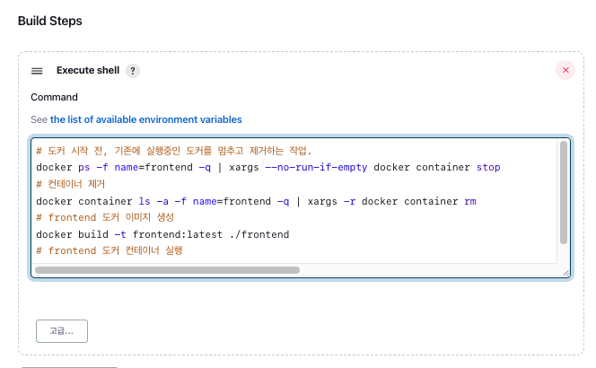
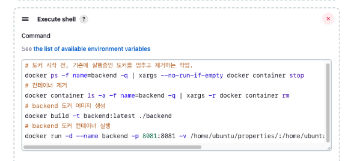
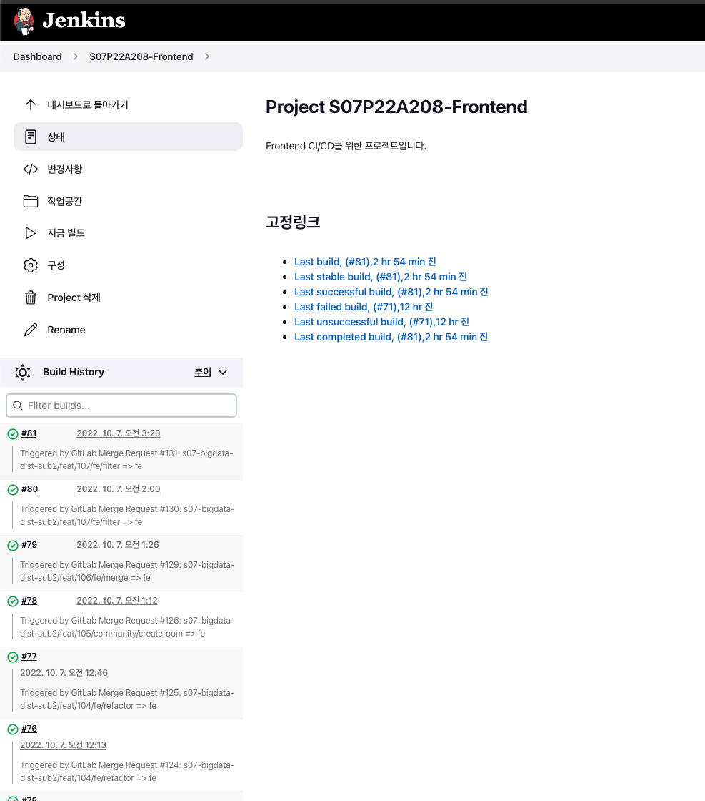
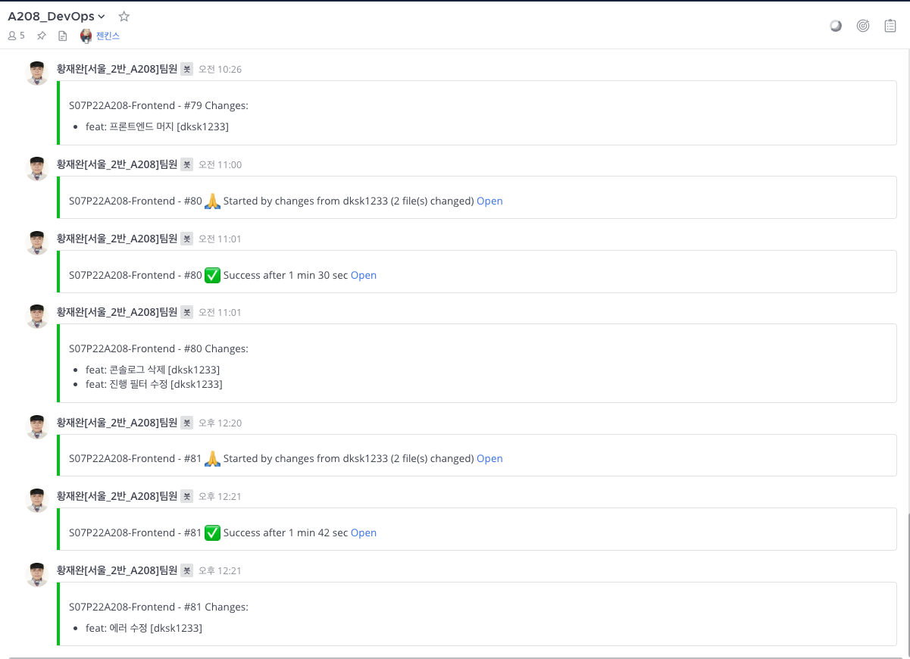

# 결정왕 김모르 Back-end

## 🌳 1. 개발 환경
- *IDE*

  - IntelliJ IDEA Ultimate 2022.2.2
    
- *Node.js*
    
  - node-v14.17.0
    
- *Vue.js*
    
  - v2.7.10
    
- *JDK*
    
  - openjdk 11.0.16 2022-07-19

- *Apache Tomcat (내장 아파치 톰캣 WAS)*
    
  - [org.apache.tomcat.embed](https://mvnrepository.com/artifact/org.apache.tomcat.embed)
     » [tomcat-embed-core](https://mvnrepository.com/artifact/org.apache.tomcat.embed/tomcat-embed-core) [v9.0.48]
    
- *웹서버 및 리버스 프록시 서버*
    
  - nginx version: nginx/1.22.0 (Ubuntu)
  - docker pull nginx:stable-alpine
  - port: 80(HTTP), 443(HTTPS)
    
- *Docker*
    
  - Docker version 20.10.18, build b40c2f6
    
- *MySQL*
    
  - v8.0.30-1.el8
  - docker pull mysql:8.0
  - port: 3306
    
- *Jenkins*
    
  - v2.361.1
  - docker pull jenkins
  - port: 8080

### 🧑‍💻 기술 스택
    
- **Spring Boot:** v2.5.2
- **RestAPI:** Spring REST Docs
- **Testing:** JUnit5, Mockito
- **Build Tool:** Gradle
- **Authorization:** Spring Security, JWT
- **DB access:** JPA, QueryDSL
- **Batch Job:** Quartz Scheduler
- **Email Send:** SMTP
## 2. Hadoop MapReduce 빅데이터 분산 처리 프로세스

### **1. 전처리**

  Raw Dataset: [업종 목적지별 배달 주문건수 데이터셋](https://bdp.kt.co.kr/invoke/SOKBP2603/?goodsCode=KGUDSTNORDER)

  

  *preprocess.py*  
  ```python
    import pandas
    
    xlsx = pandas.read_excel('./input.xlsx', sheet_name=1)
    print(xlsx.head())
    xlsx.to_csv('input.tsv', sep='\t', index=False, header=False)
  ```

### **2. 전처리 결과물**


### **3. 분산처리**

- *하둡 명령어*
    ```bash
    0. start-dfs.sh
    1. ant
    2. hdfs dfs -mkdir idontknow_wordcount
    3. hdfs dfs -put data/input.txt idontknow_wordcount
    4. hdfs dfs -rm -r idontknow_out
    5. hadoop jar ssafy.jar wordcount idontknow_wordcount idontknow_out
    6. hadoop dfs -cat idowntknow_out/part-r-0000 | more
    7. hadoop fs -get idontknow_out ~/result
    ```

- *build.xml*

    ```xml
    This XML file does not appear to have any style information associated with it. The document tree is shown below.
    <project name="Hadoop" default="package">
    <!--  Load all the default properties, and any the user wants     -->
    <!--  to contribute (without having to type -D or edit this file  -->
    <property file="${user.home}/build.properties"/>
    <property file="${basedir}/build.properties"/>
    <property name="build.encoding" value="UTF-8"/>
    <property name="lib.dir" value="/home/hadoop/hadoop/share/hadoop/"/>
    <property name="works.dir" value="${basedir}/src"/>
    <property name="build.dir" value="${basedir}/build"/>
    <property name="build.classes" value="${build.dir}/classes"/>
    <property name="build.sysclasspath" value="last"/>
    <property name="build.works" value="${build.dir}/works"/>
    <property name="javac.debug" value="on"/>
    <property name="javac.optimize" value="on"/>
    <property name="javac.deprecation" value="off"/>
    <property name="javac.version" value="1.8"/>
    <property name="javac.args" value=""/>
    <property name="javac.args.warnings" value=""/>
    <property name="javac.args.warnings" value="-Xlint:checked"/>
    <!--  the normal classpath  -->
    <path id="classpath">
    <fileset dir="${lib.dir}">
    <include name="**/*.jar"/>
    </fileset>
    </path>
    <!--  ======================================================  -->
    <!--  Stuff needed by all targets                             -->
    <!--  ======================================================  -->
    <target name="init">
    <mkdir dir="${build.dir}"/>
    <mkdir dir="${build.classes}"/>
    <mkdir dir="${build.works}"/>
    </target>
    <target name="compile-works" depends="init">
    <javac encoding="${build.encoding}" srcdir="${works.dir}" includes="**/*.java" destdir="${build.works}" debug="${javac.debug}" optimize="${javac.optimize}" target="${javac.version}" source="${javac.version}" deprecation="${javac.deprecation}">
    <compilerarg line="${javac.args} ${javac.args.warnings}"/>
    <classpath refid="classpath"/>
    </javac>
    </target>
    <!--  ==================================================================  -->
    <!--  Make the Hadoop work jar.                                           -->
    <!--  ==================================================================  -->
    <!--                                                                      -->
    <!--  ==================================================================  -->
    <target name="ssafy-works" depends="compile-works">
    <jar jarfile="${build.dir}/ssafy.jar" basedir="${build.works}">
    <manifest>
    <attribute name="Main-Class" value="ssafy/Driver"/>
    </manifest>
    </jar>
    </target>
    <!--  ==================================================================  -->
    <!--  D I S T R I B U T I O N                                             -->
    <!--  ==================================================================  -->
    <!--                                                                      -->
    <!--  ==================================================================  -->
    <target name="package" depends="ssafy-works">
    <copy file="${build.dir}/ssafy.jar" todir="../../../Desktop"/>
    </target>
    </project>
    ```
    
- *Driver.java*
    
    ```java
    package ssafy;
    
    import org.apache.hadoop.util.ProgramDriver;
    
    public class Driver {
    	public static void main(String[] args) {
    		int exitCode = -1;
    		ProgramDriver pgd = new ProgramDriver();
    		try {
    
    			pgd.addClass("wordcount", Wordcount.class, "A map/reduce program that counts pairs in the input files.");
    			pgd.driver(args);
    			exitCode = 0;
    		}
    		catch(Throwable e) {
    			e.printStackTrace();
    		}
    
    		System.exit(exitCode);
    	}
    }
    ```
    
- *Wordcount.java*
    
    ```java
    package ssafy;
    
    import org.apache.hadoop.conf.Configuration;
    import org.apache.hadoop.fs.Path;
    import org.apache.hadoop.io.IntWritable;
    import org.apache.hadoop.io.Text;
    import org.apache.hadoop.mapreduce.Job;
    import org.apache.hadoop.mapreduce.Mapper;
    import org.apache.hadoop.mapreduce.Reducer;
    import org.apache.hadoop.mapreduce.lib.input.FileInputFormat;
    import org.apache.hadoop.mapreduce.lib.output.FileOutputFormat;
    import org.apache.hadoop.util.GenericOptionsParser;
    
    import java.io.IOException;
    import java.util.HashMap;
    import java.util.Map;
    
    public class Wordcount {
    	/* 
    	Object, Text : input key-value pair type (always same (to get a line of input file))
    	Text, IntWritable : output key-value pair type
    	*/
    	public static class TokenizerMapper
    			extends Mapper<Object,Text,Text,IntWritable> {
    
    		// 자치구 => ID
    		private static Map<String, Integer> districtMap = new HashMap<>();
    		static {
    			districtMap.put("강남구", 1);
    			districtMap.put("강동구", 2);
    			districtMap.put("강북구", 3);
    			districtMap.put("강서구", 4);
    			districtMap.put("관악구", 5);
    			districtMap.put("광진구", 6);
    			districtMap.put("구로구", 7);
    			districtMap.put("금천구", 8);
    			districtMap.put("노원구", 9);
    			districtMap.put("도봉구", 10);
    			districtMap.put("동대문구", 11);
    			districtMap.put("동작구", 12);
    			districtMap.put("마포구", 13);
    			districtMap.put("서대문구", 14);
    			districtMap.put("서초구", 15);
    			districtMap.put("성동구", 16);
    			districtMap.put("성북구", 17);
    			districtMap.put("송파구", 18);
    			districtMap.put("양천구", 19);
    			districtMap.put("영등포구", 20);
    			districtMap.put("용산구", 21);
    			districtMap.put("은평구", 22);
    			districtMap.put("종로구", 23);
    			districtMap.put("중구", 24);
    			districtMap.put("중랑구", 25);
    		}
    		// variable declairations
    		private IntWritable emitVal = new IntWritable();
    		private Text emitKey = new Text();
    
    		// map function (Context -> fixed parameter)
    		public void map(Object key, Text value, Context context)
    				throws IOException, InterruptedException {
    
    			StringBuilder commonKeyText = new StringBuilder();
    			// value.toString() : get a line
    			String line = value.toString();
    			String[] row = line.split("\t");
    			String sido = row[0];
    			// 서울특별시가 아니면 그대로 리턴
    			if("서울특별시".equals(sido)) {
    				int sigungu = districtMap.get(row[1]);
    				String time = row[3];
    				commonKeyText.append(sigungu).append(",").append(time).append(",");
    				for (int i = 13; i < row.length ; i++) {
    					StringBuilder keyText = new StringBuilder(commonKeyText);
    					keyText.append(i - 12);
    					emitVal.set(Integer.parseInt(row[i]));
    					emitKey.set(keyText.toString());
    					// emit a key-value pair
    					context.write(emitKey, emitVal);
    				}
    			}
    		}
    	}
    
    	/*
    	Text, IntWritable : input key type and the value type of input value list
    	Text, IntWritable : output key-value pair type
    	*/
    	public static class IntSumReducer
    			extends Reducer<Text,IntWritable,Text,IntWritable> {
    
    		// variables
    		private IntWritable result = new IntWritable();
    
    		// key : a disticnt word
    		// values :  Iterable type (data list)
    		public void reduce(Text key, Iterable<IntWritable> values, Context context) 
    				throws IOException, InterruptedException {
    
    			int sum = 0;
    			for ( IntWritable val : values ) {
    				sum += val.get();
    			}
    			result.set(sum);
    			context.write(key,result);
    		}
    	}
    
    	/* Main function */
    	public static void main(String[] args) throws Exception {
    		Configuration conf = new Configuration();
    		String[] otherArgs = new GenericOptionsParser(conf,args).getRemainingArgs();
    		if ( otherArgs.length != 2 ) {
    			System.err.println("Usage: <in> <out>");
    			System.exit(2);
    		}
    		Job job = new Job(conf,"word count");
    		job.setJarByClass(Wordcount.class);
    
    		// let hadoop know my map and reduce classes
    		job.setMapperClass(TokenizerMapper.class);
    		job.setReducerClass(IntSumReducer.class);
    
    		job.setOutputKeyClass(Text.class);
    		job.setOutputValueClass(IntWritable.class);
    
    		// set number of reduces
    		job.setNumReduceTasks(2);
    
    		// set input and output directories
    		FileInputFormat.addInputPath(job,new Path(otherArgs[0]));
    		FileOutputFormat.setOutputPath(job,new Path(otherArgs[1]));
    		System.exit(job.waitForCompletion(true) ? 0 : 1 );
    	}
    }
    ```
    

### **4. 분산처리 결과물**

1. *part-r-00000.txt*
    
    ```
    1,0,11	6
    1,0,13	4
    1,0,2	1
    1,0,4	37
    1,0,6	134
    1,0,8	41
    1,1,1	188
    1,1,10	84
    1,1,12	34
    1,1,14	29
    1,1,3	81
    1,1,5	59
    1,1,7	30
    1,1,9	2
    1,10,1	244
    1,10,10	498
    1,10,12	22
    1,10,14	17
    1,10,3	5
    1,10,5	0
    1,10,7	3
    1,10,9	9
    1,11,11	20
    1,11,13	71
    1,11,2	239
    1,11,4	74
    1,11,6	35
    ```
    
2.  *part-r-00001.txt*
    
    ```
    1,0,1	213
    1,0,10	106
    1,0,12	35
    1,0,14	32
    1,0,3	94
    1,0,5	102
    1,0,7	27
    1,0,9	6
    1,1,11	3
    1,1,13	3
    1,1,2	1
    1,1,4	35
    1,1,6	96
    1,1,8	48
    1,10,11	14
    1,10,13	13
    1,10,2	72
    1,10,4	22
    1,10,6	2
    1,10,8	14
    1,11,1	439
    1,11,10	468
    1,11,12	43
    1,11,14	29
    1,11,3	14
    1,11,5	22
    1,11,7	12
    1,11,9	74
    1,12,11	13
    ```
    

### **5. 후처리**
*postprocess.py*
```python
# 2. part-r-00000, part-r-00001 파일을 하나의 csv 파일로 합치기 (정렬 포함)
import csv

res = []
with open('part-r-00000', 'r') as f1, open('part-r-00001', 'r') as f2, open('result.csv', 'w', encoding='utf-8', newline='') as f3:
    rows = f1.readlines()
    for row in rows:
        key, value = row.rstrip().split('\t')
        row = list(map(int, key.split(',')))
        row.append(int(value))
        res.append(row)
    rows = f2.readlines()
    for row in rows:
        key, value = row.rstrip().split('\t')
        row = list(map(int, key.split(',')))
        row.append(int(value))
        res.append(row)
    res.sort()
    csv_writer = csv.writer(f3)
    csv_writer.writerow(["자치구 코드", "시간대", "메뉴 코드", "총 배달 건수"])
    csv_writer.writerows(res)
```
    

### **6. 후처리 결과물**
*output.csv*  


### **7. 분산처리 최종 결과물 DB에 저장**
*insert.sql*
```sql
SET FOREIGN_KEY_CHECKS = 0;

USE  idontknow;

LOAD DATA INFILE 'C:\\ProgramData\\MySQL\\MySQL Server 8.0\\Uploads\\result.csv'
INTO TABLE data
FIELDS TERMINATED BY ','
ENCLOSED BY '"'
LINES TERMINATED BY '\n'
IGNORE 1 LINES
(@district_id, @`time`, @menu_id, @order_quantity)
SET `district_id` = @district_id,
    `time` = SEC_TO_TIME(@`time`*60*60),
    `menu_id` = @menu_id,
    `order_quantity` = @order_quantity;

SET FOREIGN_KEY_CHECKS = 1;
```

## 👷‍♀️ 3. 빌드 및 DevOps 메뉴얼

### DevOps 목표  

  **1. develop branch에 feat branch를 merge 하였을때 도커 이미지 빌드 및 컨테이너 배포**  
  **2. Jenkins, MySQL, Spring Boot Application + Tomcat, Vue.js + Nginx를 모두 컨테이너화하여 배포**

### Jenkins 설정

- Jenkins port: 8080
- 아래와 같이 Front-end, Back-end CI/CD 구축을 위한 아이템 2개 생성
  


- Jenkins Item 구성은 다음과 같이 설정
  - Frontend Item은 Backend Item과 `Filter merge request by label` 과 `Branch Specifier (blank for 'any')`를 제외하고 동일
    
    
    
    
    
    
    
### DevOps_기본 세팅
- Jenkins, MySQL docker container 실행
  - *docker-compose.mysql.yml*
    ```yml
      version: '3'
      services:
        mysql:
          image: mysql:8.0
          container_name: mysql
          ports:
            - 3306:3306 # HOST:CONTAINER
          environment:
            MYSQL_DATABASE: idontknow           
            MYSQL_ROOT_PASSWORD: admin@a208!@
            MYSQL_USER: develop
            MYSQL_PASSWORD: develop@a208!@
            TZ: Asia/Seoul
          command:
            - --character-set-server=utf8mb4
            - --collation-server=utf8mb4_unicode_ci
          volumes:
            - ./mysql/data:/var/lib/mysql
          networks:
            - idontknownetwork
      - 
      networks:
        idontknownetwork:
          external: true
    ```
  - *docker-compose.jenkins.yml*
      ```yml
        version: '3'
        services:
            jenkins:
                image: jenkins/jenkins:lts
                container_name: jenkins
                volumes:
                    - /var/run/docker.sock:/var/run/docker.sock
                    - /jenkins:/var/jenkins_home
                ports:
                    - "8080:8080"
                privileged: true
                user: root
        ```
- docker network 생성
  - `sudo docker network create idontknownetwork` : docker 컨테이너간의 네트워크 생성 (`idontknownetwork`라는 이름의)
- Jenkins 컨테이너 안에서 docker 실행하면 Host의 도커와 연결됨
- 아래의 Dockerfile들을 backend/ 와 frontend/에 각각 하나씩 넣고 nginx.conf는 /frontend에 넣음

### Docker_Frontend 명령어


```bash
# 도커 시작 전, 기존에 실행중인 도커를 멈추고 제거하는 작업.
docker ps -f name=frontend -q | xargs --no-run-if-empty docker container stop

# 컨테이너 제거
docker container ls -a -f name=frontend -q | xargs -r docker container rm

# frontend 도커 이미지 생성
docker build -t frontend:latest ./frontend

# frontend 도커 컨테이너 실행 
docker run -d --name frontend -p 80:80 -p 443:443 -v /etc/letsencrypt/:/etc/letsencrypt/ -v /etc/localtime:/etc/localtime:ro --network idontknownetwork frontend:latest
```
- `-v /etc/letsencrypt/:/etc/letsencrypt/` 로 volumne mount 경로를 잡은 이유: pem키가 symlink로 저장되었기 때문에 letsencrpyt경로부터 volume mount 해야함 !!! 😄

### Docker_Backend 명령어

```bash
# 도커 시작 전, 기존에 실행중인 도커를 멈추고 제거하는 작업.
docker ps -f name=backend -q | xargs --no-run-if-empty docker container stop

# 컨테이너 제거
docker container ls -a -f name=backend -q | xargs -r docker container rm

# backend 도커 이미지 생성
docker build -t backend:latest ./backend

# backend 도커 컨테이너 실행
docker run -d --name backend -p 8081:8081 -v /home/ubuntu/properties/:/home/ubuntu/properties/ --network idontknownetwork backend:latest
```


### Docker_Frontend Dockerfile

```docker
FROM node:lts-alpine as build-stage
WORKDIR /frontend

COPY . .
RUN npm install
RUN npm run build

FROM nginx:stable-alpine as production-stage

RUN rm /etc/nginx/conf.d/default.conf
COPY ./nginx.conf /etc/nginx/conf.d/nginx.conf
COPY --from=build-stage ./frontend/dist /usr/share/nginx/html
EXPOSE 80 443
CMD ["nginx", "-g", "daemon off;"]
```


### Docker_Backend Dockerfile

- 이슈: classpath 인식 안되어 application.yml을 스프링이 읽지 못했음 → 해결: application.yml 을 컨테이너에 직접 복사 후 사용함

```docker
FROM openjdk:11
COPY /build/libs/api-0.0.1-SNAPSHOT.jar app.jar
COPY /src/main/resources/application.yml application.yml
EXPOSE 8081
ENTRYPOINT ["java", "-jar", "-Duser.timezone=Asia/Seoul", "-Dspring.profiles.active=prod", "-Dspring.config.location=/application.yml,/home/ubuntu/properties/application-db.yml", "app.jar"]
```

### Docker_Frontend nginx.conf

```bash
server {
        listen 80 default_server;
        listen [::]:80 default_server;

        server_name j7a208.p.ssafy.io;

        return 301 https://$server_name$request_uri;
}

server {
        listen 443 ssl;
        listen [::]:443 ssl;

        root /usr/share/nginx/html;
        index index.html index.htm;

        server_name j7a208.p.ssafy.io;

        ssl_certificate /etc/letsencrypt/live/j7a208.p.ssafy.io/fullchain.pem;
        ssl_certificate_key /etc/letsencrypt/live/j7a208.p.ssafy.io/privkey.pem;

        location / {
                try_files $uri $uri/ /index.html;
        }

        location /api {
                proxy_pass http://backend:8081;
                proxy_http_version 1.1;
                proxy_set_header Connection "";
                proxy_set_header Host $host;
                proxy_set_header X-Real-IP $remote_addr;
                proxy_set_header X-Forwarded-For $proxy_add_x_forwarded_for;
                proxy_set_header X-Forwarded-Proto $scheme;
                proxy_set_header X-Forwarded-Host $host;
                proxy_set_header X-Forwarded-Port $server_port;
        }

        location /docs {
              proxy_pass http://backend:8081;
        }
}
```

- `http://backend:8081` 의 `backend`는 idontknow network에 속한 backend container 이름
  
### DevOps 결과
- Jenkins 빌드 결과



- Mattermost 빌드 및 배포 알림

## 🏗️ 4. 프로젝트 구조도
```text
.
└── src
    ├── docs
    │   └── asciidoc
    ├── main
    │   ├── java
    │   │   └── com
    │   │       └── idk
    │   │           └── api
    │   │               ├── common
    │   │               │   ├── advice
    │   │               │   ├── category
    │   │               │   ├── entity
    │   │               │   └── exception
    │   │               ├── config
    │   │               │   └── jpa
    │   │               ├── districtcode
    │   │               │   ├── domain
    │   │               │   │   ├── entity
    │   │               │   │   └── repository
    │   │               │   └── exception
    │   │               ├── home
    │   │               │   ├── config
    │   │               │   ├── controller
    │   │               │   ├── domain
    │   │               │   │   ├── entity
    │   │               │   │   └── repository
    │   │               │   ├── dto
    │   │               │   ├── exception
    │   │               │   ├── scheduler
    │   │               │   └── service
    │   │               ├── menucode
    │   │               │   └── domain
    │   │               │       ├── entity
    │   │               │       └── repository
    │   │               ├── user
    │   │               │   ├── controller
    │   │               │   ├── domain
    │   │               │   │   ├── entity
    │   │               │   │   └── repository
    │   │               │   ├── dto
    │   │               │   ├── exception
    │   │               │   ├── security
    │   │               │   │   ├── token
    │   │               │   │   └── userdetails
    │   │               │   └── service
    │   │               └── vote
    │   │                   ├── controller
    │   │                   ├── domain
    │   │                   │   ├── entity
    │   │                   │   └── repository
    │   │                   ├── dto
    │   │                   ├── exception
    │   │                   └── service
    │   └── resources
    ├── rest
    └── test
        └── java
            └── com
                └── idk
                    └── api
                        └── api
                            └── home
                                └── controller
```